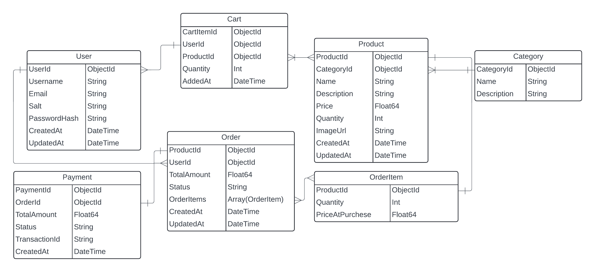

# SyCart
Simple implemtation using Go, GoFiber, and MongoDB

## Database Design


## Postman Collection
CLick Here to Download the Postman Collection  
[Postman Collection](Cart%20Spec.postman_collection.json)

## Installation
```bash
go mod tidy
go build -o main cmd/api/main.go
```

## Installation Using Docker
```bash
docker compose up -d
```

## Usage
```bash
./main
```